

  <strong>Desafio CSS de 100 Dias</strong>
   
  <em>Estou no dia 40</em>

Este é um desafio CSS extraído do site [100 Days CSS](https://100dayscss.com). O desafio é uma oportunidade emocionante para melhorar suas habilidades em CSS e SCSS ao longo de 100 dias consecutivos de prática. Abaixo está o desafio de cada dia, juntamente com uma imagem representativa:

## Dia 1: Início da Jornada

o início do desafio "100 Days Challenge". Com design marcante, convida a uma jornada de crescimento e aprendizado. Cada dia é uma oportunidade para explorar e criar.

## Dia 2: Ícone de Menu Interativo

Este ícone de menu traz uma abordagem dinâmica à sua interface. Com animações suaves e transições elegantes, convida os usuários a explorar as opções disponíveis.

## Dia 3: Cenário Animado

Este elemento animado traz uma cena solar dinâmica para o seu projeto. Com movimentos suaves e transições de cor, adiciona um toque visualmente cativante à interface. 

## Dia 4: Animação de Bolhas

Esta animação de bolhas adiciona um toque lúdico à sua interface. Com movimentos alternados e sombras suaves, os pontos pulsam em um padrão cativante.

## Dia 5: Relatório Semanal

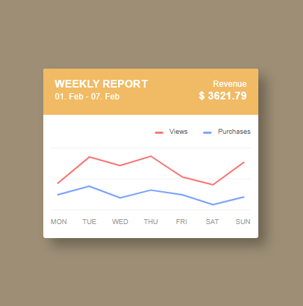

Este componente exibe um relatório semanal de forma clara e organizada. Com uma interface limpa e legível, fornece informações essenciais de forma visualmente atraente.

## Dia 6: Meu Perfil

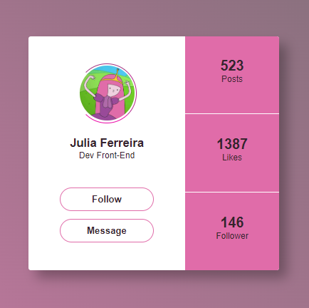

Este desafio apresenta um perfil fictício sobre mim mesma de forma convidativa e legível.

## Dia 7: Painel de Notificações Interativo

Este desafio apresenta um painel de notificações interativo. O componente exibe notificações recentes em um layout limpo e organizado, permitindo a fácil identificação do tempo e da mensagem. Os ícones de menu e pesquisa oferecem funcionalidades adicionais, enquanto as animações suaves tornam a interação mais agradável.

## Dia 8: Efeito de Partículas Abstratas

 Este desafio apresenta um efeito visualmente interessante de partículas abstratas. O componente consiste em uma esfera central embaçada com várias partículas em tamanhos e rotações variáveis ao seu redor. 
 
## Dia 9: Cenário Noturno com Lua e Chuva

Gotas de chuva são simuladas com elementos circulares em diferentes tamanhos e opacidades, criando um efeito de profundidade e movimento. 

## Dia 10: Relógio Analógico com Detalhes 

Este desafio apresenta um relógio analógico com elementos interativos. O relógio é exibido no centro do cenário, cercado por pequenos pontos que representam os minutos e segundos.

## Dia 11: Botas andantes 

As pernas estão animadas para balançar para frente e para trás, enquanto os sapatos giram em torno de seus próprios eixos.

## Dia 12: Frase com Destaque

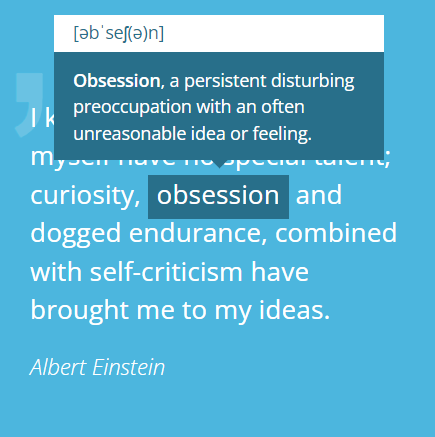

Um efeito de destaque é adicionado à citação através de aspas estilizadas antes do texto. Além disso, a palavra "obsessão" é destacada como um termo-chave, fornecendo uma definição interativa quando o usuário passa o mouse sobre ela.

## Dia 13: Perfis Interativos

Quando o usuário passa o mouse sobre um perfil, a sobreposição escura se torna mais transparente e o ícone de adição se torna visível, indicando que o perfil é interativo.Quando o usuário clica em um perfil, uma janela de detalhes aparece, exibindo uma imagem de cabeçalho, a imagem de perfil em destaque, o nome do perfil e opções de ação, como chamada telefônica, mensagem e favorito.

## Dia 14: Cartão Animado

Este design apresenta um cartão animado com efeito de flip. Ao passar o mouse sobre o cartão, ele gira em torno do eixo X, revelando o conteúdo na parte de trás.

## Dia 15: Área de Upload de Arquivos

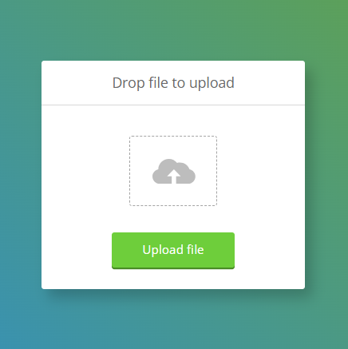

A área é destacada por uma barra verde que indica o progresso do upload e um botão de upload com uma animação de sincronização quando um arquivo é selecionado. Ao clicar no botão de upload, o arquivo é enviado e uma marca de verificação aparece para indicar que o upload foi concluído. 

## Dia 16: Animações Encantadoras

Este projeto apresenta animações encantadoras que adicionam um toque de magia a uma simples tela.

## Dia 17: Geometria Estilizada

As transições suaves entre essas seções adicionam profundidade e interesse visual.Ao passar o mouse sobre o polígono, as cores mudam suavemente, adicionando uma interatividade sutil à experiência.

## Dia 18: Animação Elástica de Elipse

Este design apresenta uma animação elástica em forma de elipse, onde duas metades coloridas (cinza e verde) se alternam de forma suave. O efeito é alcançado usando keyframes para definir diferentes ângulos de rotação ao longo do tempo. As áreas superior e inferior do quadro são preenchidas com cores sólidas (cinza e verde, respectivamente), criando um contraste interessante com a elipse em movimento. O uso do transform-style: preserve-3d; permite que a animação seja renderizada de forma tridimensional, adicionando profundidade ao efeito visual.

## Dia 19: Alternância de Fundo com Botões Circulares

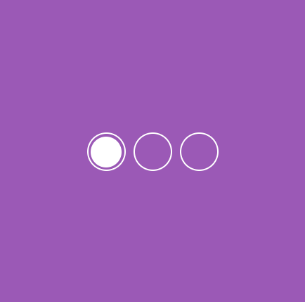

Este é um design interativo que permite alternar entre diferentes fundos coloridos usando botões circulares. Cada botão circular representa uma opção de fundo e está associado a um input de rádio invisível. 

## Dia 20: Botão de Envio de E-mail Animado

Este design apresenta um botão de envio de e-mail animado com caixas de seleção e rótulos correspondentes para interação.

## Dia 21: Animação Pac-Man

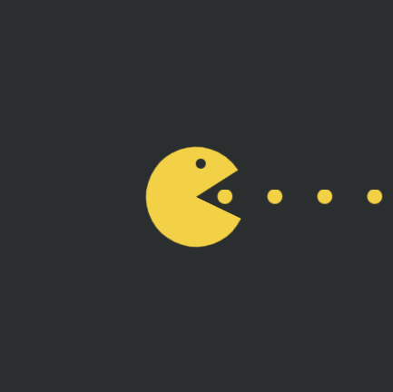

Neste design, temos uma animação do Pac-Man clássico. Um círculo amarelo representa o Pac-Man, com um efeito de boca animado que se abre e fecha. Além disso, há um par de olhos que se movem de forma independente e um conjunto de pontos que indicam o caminho percorrido pelo Pac-Man.

## Dia 22: Monitoramento de Progresso Diário

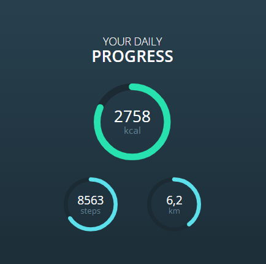

Este design oferece um resumo visual do progresso diário, exibindo informações sobre calorias queimadas, passos dados e distância percorrida.

## Dia 23: Inspiração de Design de Texto Animado

Este desafio cria uma maneira interresante de fazer um texto animado.

## Dia 24:  Botão de Conclusão Animado

O botão "Finish" possui um ícone de marca de seleção que aparece quando o botão é ativado.

## Dia 25: Mapa Interativo com Marcador

O marcador pode ser clicado para revelar informações sobre um local específico.

## Dia 26:  Slider de Mensagens Inspiradoras

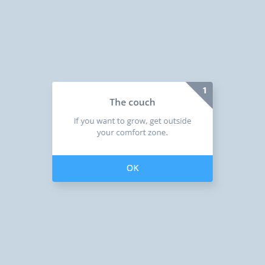

Cada mensagem é exibida em uma carta que contém um número, um título e um texto. As cartas deslizam suavemente para cima quando são trocadas, proporcionando uma transição agradável entre as mensagens.

## Dia 27: Lista de Tarefas

Cada item da lista tem uma caixa de seleção, um texto descritivo da tarefa e um botão de marcação. Quando uma tarefa é concluída, o texto da tarefa fica cinza, o botão de marcação desaparece e um marcador de verificação animado aparece para indicar que a tarefa foi concluída.

## Dia 28: Animação de sino tocando

Várias linhas de som se movem para fora e para dentro, enquanto o sino trepida, criando uma representação visual do som de um sino.

## Dia 29: Barra de Pesquisa com Sugestões

Quando o usuário começa a digitar, as sugestões relevantes são exibidas abaixo da barra de pesquisa. O JavaScript é usado para atualizar dinamicamente as sugestões com base no texto digitado pelo usuário.

## Dia 30: Linha Circular em Movimento
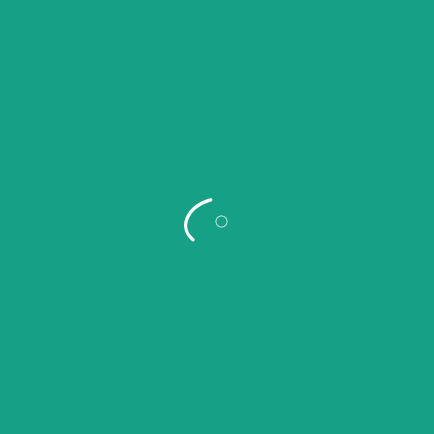

Uma animação visualmente atraente de uma linha curva e uma pequena bola que se move ao longo dela. A linha e a bola são estilizadas com cores vibrantes e uma animação suave é aplicada para criar um efeito de movimento contínuo.

## Dia 31: Pendulares em Movimento

Uma animação de uma série de pontos que oscilam para a esquerda e para a direita, como um pêndulo. Cada ponto é representado por um círculo branco e eles oscilam em diferentes velocidades para criar um efeito visualmente interessante.

## Dia 32: Contador Interativo

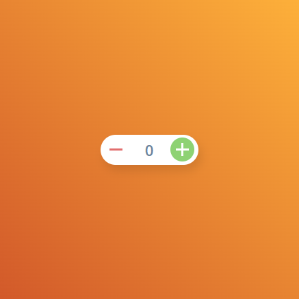

Os botões de adição e subtração têm animações de transição ao serem clicados, mudando de cor para indicar a ação. O número dentro do contador é atualizado dinamicamente conforme os botões são clicados, com animações de fade in e fade out para suavizar a transição entre os números.

## Dia 33: Cena do Céu

As nuvens são representadas por três elementos SVG de diferentes tamanhos, cada um com uma animação de deslocamento lateral para criar a ilusão de movimento das nuvens. O sol é representado por um círculo amarelo posicionado no canto superior esquerdo da moldura, e ele também tem uma animação de deslocamento lateral para simular o movimento do sol no céu.

## Dia 34: Linhas de Texto Animadas

 As linhas de texto são representadas por elementos 
 com uma altura de 2 pixels e uma largura de 225 pixels, com fundo branco. As linhas de texto estão posicionadas verticalmente no centro da moldura e são animadas para aparecer uma por uma. O texto é adicionado usando elementos <svg> com caminhos <path> que formam letras. Cada letra é desenhada por um caminho com um contorno cor-de-rosa (#EA4C89) e um preenchimento branco (#fff). A animação é aplicada aos caminhos para simular a aparência gradual do texto. A moldura tem um fundo rosa (#EA4C89) e é centralizada na página usando position: absolute e transform: translate(-50%, -50%). 
 
## Dia 35: Círculo de Carregamento Animado

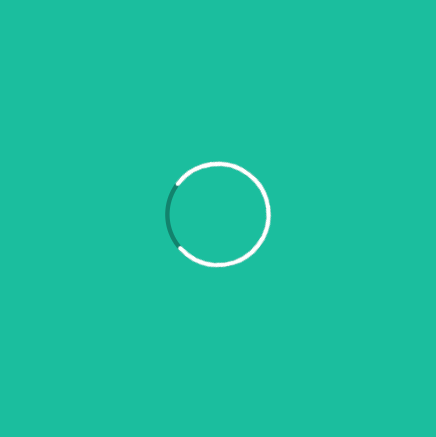

Neste desafio é criado um círculo de carregamento animado. O indicador de carregamento é animado usando a propriedade stroke-dasharray para criar um efeito de traço, enquanto a propriedade transform é usada para girar o círculo ao longo do tempo para simular o carregamento. 

## Dia 36: Tabs de Navegação com Ícones

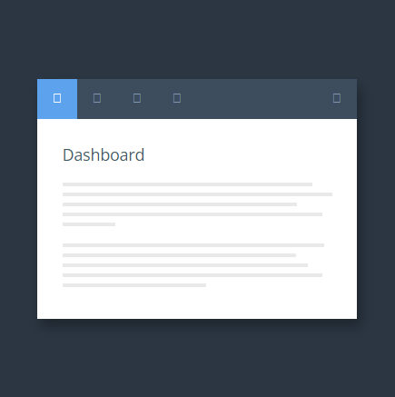

Neste desafio é criado uma interface de navegação com guias usando ícones. 

## Dia 37: Cards Animados em Perspectiva

Cada card tem uma aparência de cartão, com uma parte superior colorida e uma área de conteúdo com várias linhas horizontais. Os cards estão dispostos em um layout de grade, com cada card animado para se mover para frente e para trás em um efeito de alternância. 

## Dia 38: Cores Alternantes

A cor branca é inicialmente exibido em tamanho normal, enquanto a cor roxa é exibido em tamanho pequeno e é escalado para o tamanho normal quando o quadro é clicado. 

## Dia 39:  Ícone de Menu Animado

O ícone de menu é representado por duas linhas horizontais, uma acima e outra abaixo. O CSS define estilos para o quadro, o ícone de menu e a lista de itens de menu. As linhas do ícone de menu têm animações CSS que controlam sua abertura e fechamento. Quando o ícone de menu é clicado, a classe active é adicionada ao ícone e à lista de menu, o que aciona a animação de abertura. Quando a lista de menu é clicada, a classe active é removida do ícone e da lista de menu, o que aciona a animação de fechamento. O JavaScript vincula os eventos de clique ao ícone de menu e à lista de menu para controlar a ativação e desativação das animações.

## Dia 40: Grade de Imagens Responsiva com Efeito de Ampliação

As imagens têm um tamanho inicial e são posicionadas em uma grade utilizando variáveis SCSS para calcular as posições. O JavaScript vincula um evento de clique às imagens para controlar a ativação e desativação das animações. 
